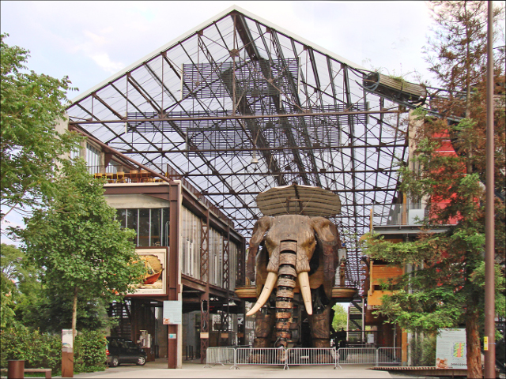
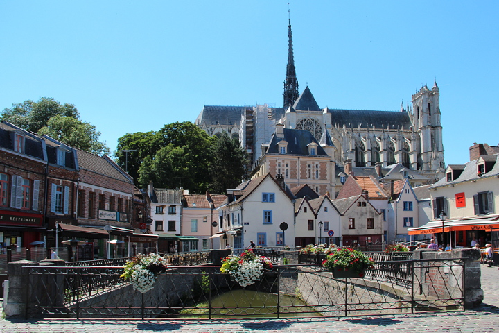
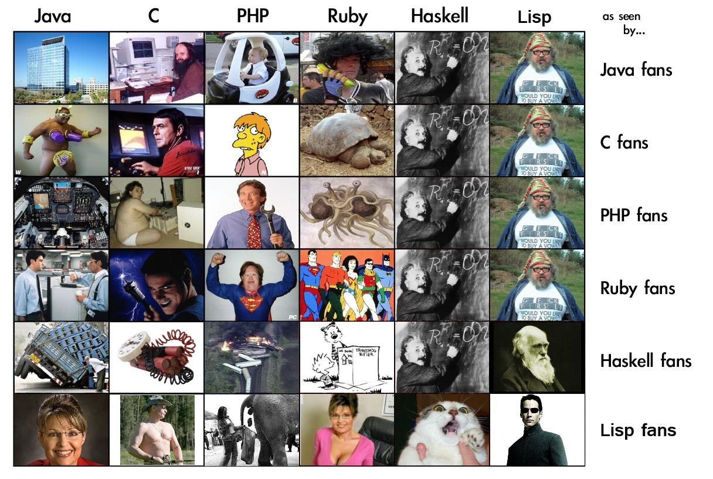
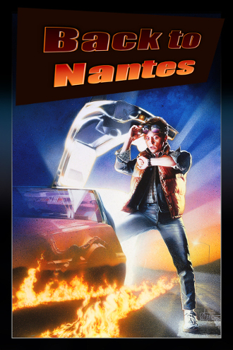
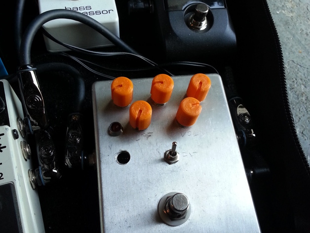

# Hi, have you met Pierre-Yves ?

===

## Je suis originaire de Nantes

==

J'y ai fait des choses passionnantes, comme...

==

Mes &eacute;tudes...

==

D&eacute;couvrir GNU/Linux.

==

Mais aussi du VBA

===
Puis j'ai d&eacute;cid&eacute; de me changer les id&eacute;es...

Et de partir pour Amiens <!-- .element: class="fragment" data-fragment-index="1" -->
 <!-- .element: class="fragment" data-fragment-index="1" -->

==

L'occasion de d'apprendre de nouveaux langages

===
Avant de revenir sur Nantes

==

D&eacute;couvrir de nouveaux jouets

===

Aujourd'hui, une nouvelle aventure commence pour moi...

===

Et quand je ne fais pas d'informatique, je fais aussi...

==

De la musique

<audio controls="controls">
  <source type="audio/mp3" src="images/scuba.mp3"></source>
  
Your browser does not support the video element.

</audio>

==

De l'impression 3D (parfois r&eacute;ussie)

==

Des [bidouilles](https://github.com/pyaillet/temperatures) en tout [genre](https://github.com/pyaillet/scan)...

===

N'h&eacute;sitez pas &agrave; me pinger !

===

_Ou plut&ocirc;t le d&eacute;but..._
